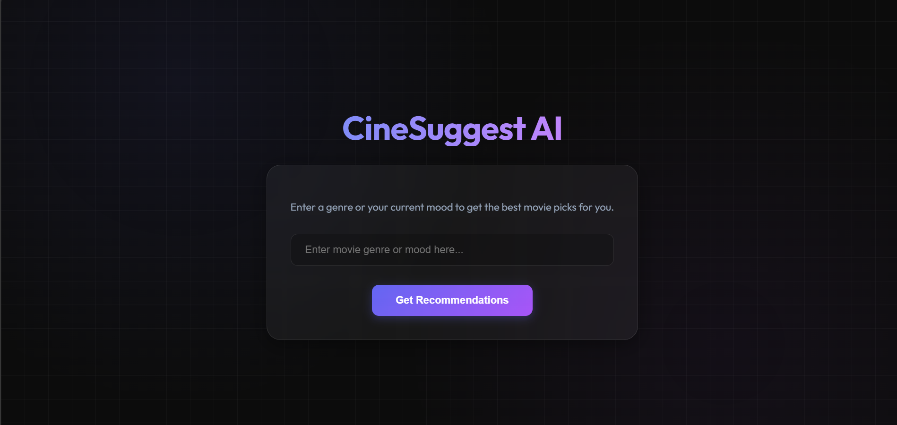

# CineSuggest AI

A simple movie recommendation app made with MERN and Gemini AI.

### How to use:
1. **Backend**: Go to `backend` folder, run `npm i` then `npm run dev`.
2. **Frontend**: Go to `frontend` folder, run `npm i` then `npm run dev`.
3. **API Key**: Put your `GEMINI_API_KEY` in the `.env` file inside the backend folder.

Just type your mood or a genre and get recommendations. 🎬
